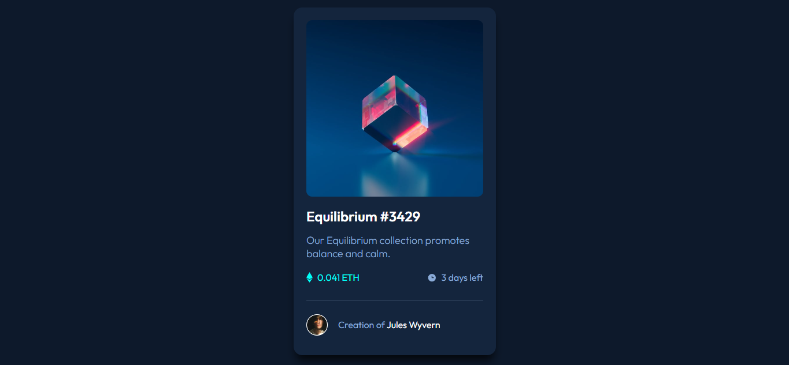

# Frontend Mentor - NFT preview card component solution

This is a solution to the [NFT preview card component challenge on Frontend Mentor](https://www.frontendmentor.io/challenges/nft-preview-card-component-SbdUL_w0U). Frontend Mentor challenges help you improve your coding skills by building realistic projects. 

## Table of contents

- [The challenge](#the-challenge)
- [Screenshot](#screenshot)
- [Links](#links)
- [Built with](#built-with)
- [Author](#author)

### The challenge

Users should be able to:

- View the optimal layout depending on their device's screen size
- See hover states for interactive elements

### Screenshot

### Links

- Solution URL: [Github Repo](https://github.com/jahongirdev/nft-preview-card-component-main)
- Live Site URL: [Live Preview](https://frontendmentor-nftcomponent.netlify.app/)

### Built with

- Semantic HTML5 markup
- CSS custom properties
- Flexbox
- CSS Grid
- Mobile-first workflow

## Author

- Website - [Jahongir Murodboev](https://t.me/cyberj0hn)
- Frontend Mentor - [@jahongirdev](https://www.frontendmentor.io/profile/jahongirdev)
- Twitter - [@JahongirDev](https://www.twitter.com/JahongirDev)
